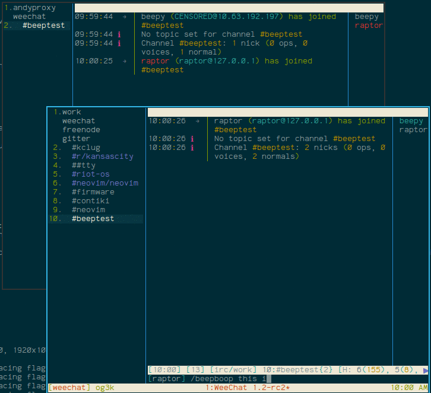

# Beep-boop

Beep-boop is a simple plugin (in python) for weechat.  It mostly functions as
a means to annoying coworkers not using weechat.  This plugin adds
a `/beepboop` command that encodes sent messages to morse code (with dash being
beep and dot being boop).  On the receiving end, beepboop messages will be
decoded by anyone running the beepboop plugin.

## Installation

1. Place `beepboop.py` into `~/.weechat/python/autoload` (create this directory
   if it does not already exist)
2. Restart weechat
3. Enjoy using `/beepboop` with reckless abandon.
